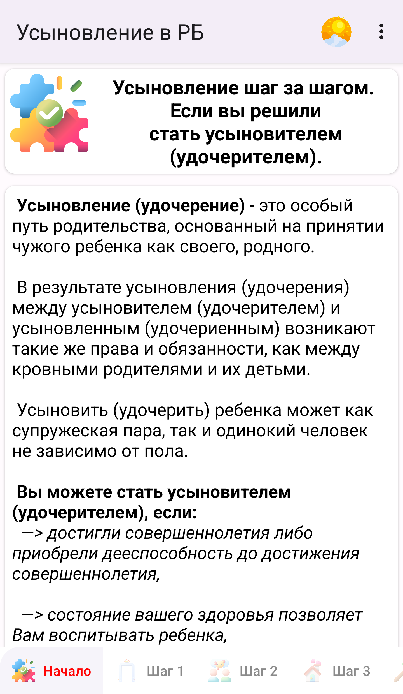
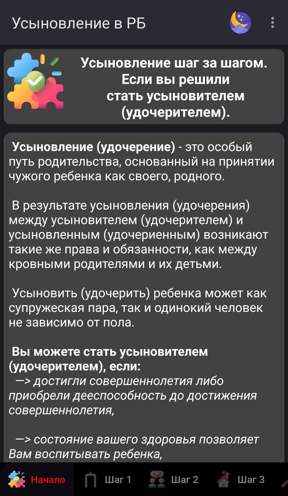

# Усыновление в Республике Беларусь.
  

Данная программа представляет собой своего рода путеводитель по процедуре усыновления (удочерения).  
Это краткий (пошаговый) алгоритм действий, которые необходимо предпринять гражданам, который
изъявили желание принять в свою семью усыновленного (удочеренного) ребенка.

Приложение бесплатное, в нем отсутствует рекламо, оно не собирает никакой личной информации.

## Требования:
* Мобильное устройство на платформе Android,
* Версия Android 4.4 "KitKat" и выше.

## Скриншоты:
<table>
  <tr>
    <td><h3>Дневная тема</h3></td>
    <td><h3>Ночная тема</h3></td>
  </tr>
  <tr>
    <td></td>
    <td></td>
  </tr>
</table>

## Поддержка:
Хотите внести свой вклад?  
Приветствуется любой вклад: от кода до документации, графики, предложений по дизайну и отчетов об ошибках.  Пожалуйста, используйте GitHub в полной мере — добавляйте запросы, добавляйте учебные пособия или другой контент — все, что вы можете предложить, мы можем использовать!

Если у вас есть сообщения об ошибках, пожелания или вопросы, откройте [Issues](https://github.com/MisterTowelie/AdoptiveParentBelarus/issues) или отправьте нам сообщение

## Пожертвования:
Пожертвование не являются обязательными условиями для использования приложения Усыновление (удочерение) Республика Беларусь.
Хотя Усыновление (удочерение) Республика Беларусь не поддерживает никаких покупок, пожертвования могут быть отправлены разработчику, чтобы поддержать его и его работу!

## License
  
This program is Free Software: You can use, study share and improve it at your
will. Specifically you can redistribute and/or modify it under the terms of the
[GNU General Public License](https://www.gnu.org/licenses/gpl-3.0.html) as
published by the Free Software Foundation, either version 3 of the License, or
(at your option) any later version.

Some icons are made
by [Freepik](https://www.flaticon.com/authors/freepik),[Vectors tank](https://www.flaticon.com/authors/vectors-tank),
[Mehwish](https://www.flaticon.com/authors/mehwish),[Icongeek26](https://www.flaticon.com/authors/icongeek26),
[Iconixar](https://www.flaticon.com/authors/iconixar), [Ehtisham Abid](https://www.flaticon.com/authors/ehtisham-abid)
from [Flaticon](http://www.flaticon.com) or by Google and are licensed by
[Creative Commons BY 3.0](https://creativecommons.org/licenses/by/3.0/).

Other icons are from the
[Material Design Icon set](https://github.com/google/material-design-icons)
released under an
[Attribution 4.0 International license](https://creativecommons.org/licenses/by/4.0/).
